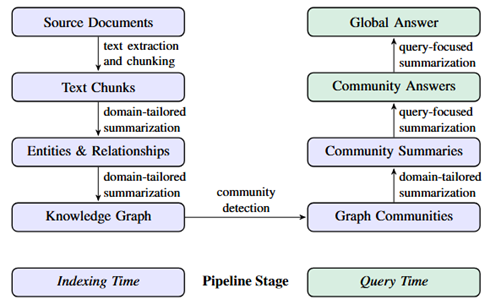
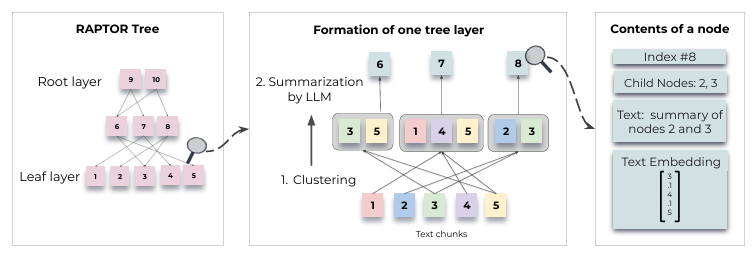
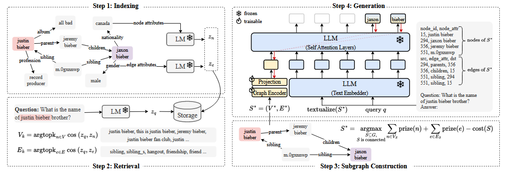
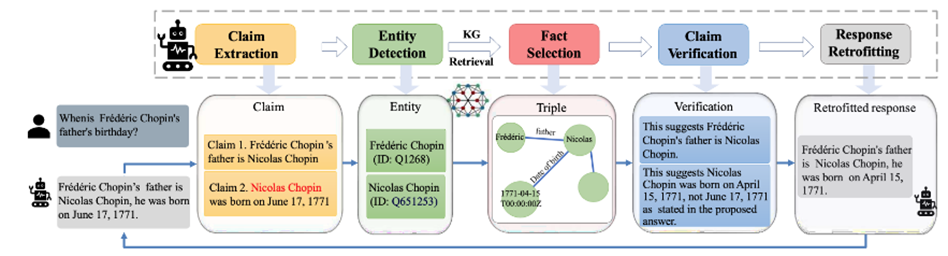
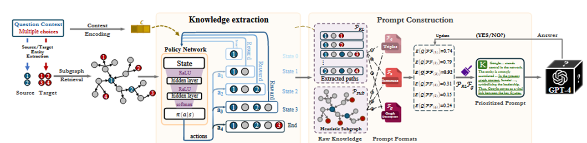
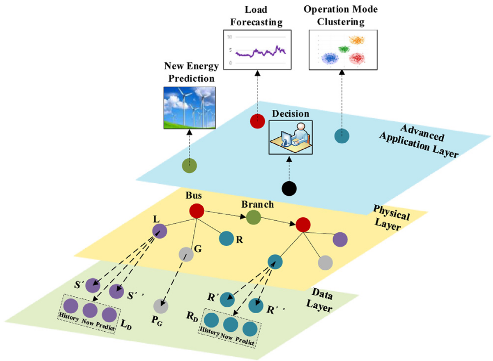

本周主要阅读了有关KG解决LLM幻觉的论文，主要集中在graphrag范式[3,4,5]和知识图谱提示[6,7,8],另外还有知识图谱应用到电力调度决策的论文[9,10],这两篇主要是介绍电力调度可以用知识图谱辅助。一些总结和初步想法如下：

# 基于KG的调度决策路径探索
为了解决将LLM应用于特定领域时出现的幻觉问题，大致可以采取三类措施：微调（FT）、检索增强生成（RAG）和KG增强LLM。
## 1.使用特定领域的数据微调LLM
微调旨在通过使用特定领域的数据来训练预训练好的LLM，从而使模型能够适应目标领域的知识。这个过程通过让LLM接触特定领域的词汇、术语和模式，使其能够为该领域的任务生成更准确、更相关的回答。这种方式不适用闭源模型，且当新知识与预训练时学到的信息相冲突时，可能会产生新的幻觉或者造成灾难性遗忘。
## 2.LLM的检索增强生成（RAG）
RAG模型旨在通过从文本语料库或在线等外部知识源中检索信息来增强大型语言模型。这种方法将LLM与外部知识检索系统相结合，以帮助减少幻觉的产生。

然而在特定领域应用中，RAG方法面临以下挑战：首先，领域知识通常是复杂且具有层级结构，文本文件通常以线性和非结构化的方式呈现这些信息。RAG模型无法利用领域知识内部的结构化联系来进行推理，从而限制了其能力。其次，文本文件含有大量噪声信息，特定领域的术语往往分布稀疏，导致了基于文本的RAG面临着巨大的搜索空间。
## 3.KG增强LLM
KG增强LLM旨在利用知识图谱（KG）中的结构化知识，将模型的回答依据建立在既定的事实和原则之上。从而确保生成的输出基于可靠的信息，而不是任意或捏造的陈述。该方法分为以下三类：
### 3.1训练阶段集成
在LLM训练阶段集成知识图谱的方法，其核心思想是在语言模型的预训练（pre-training）或微调（fine-tuning）过程中，就通过专门的融合框架对齐实体与词嵌入[1]，将知识图谱中的结构化知识注入到模型内部参数中。由于LLM参数量巨大，这种联合训练的方式训练成本十分高昂。同时，在引入KG三元组的过程中也会不可避免地引入噪声[2]。
### 3.2推理阶段集成
LLM推理阶段集成KG，即：在用户提出问题、模型正在生成答案的时候（即推理阶段），动态地从KG中检索相关信息，并将这些信息作为额外的、实时的上下文提供给一个已经预训练好的LLM，以帮助其生成更准确、更符合事实的回答。这种方法本质也是检索增强生成（RAG）,但是是以图的形式与LLM交互，因此将其归入KG增强LLM。

其中最著名的是微软的graphrag[3],该方法解决传统向量rag的局限，结合知识图谱可以有效回答那些需要对整个文本语料库进行全面理解的“全局性问题”。

如图所示，核心工作流程分为索引和查询两个阶段。索引阶段，属于数据预处理阶段，主要目的是从提供的文档集合中，提取出知识图谱，然后以聚类算法(Leiden)，将知识图谱分为数个社区(community)，并总结每个社区(community)所表达的含义(community summary)。查询阶段，是建立在索引建立的阶段基础上，GraphRAG系统的终端用户，在此阶段加入进来，并向系统提供查询指令Instruct。GraphRAG将用户Instruct与每个社区的community summary进行相似度匹配，LLM将匹配结果汇总，合成一个全面、连贯的“全局答案”并返回给用户。由于在查询阶段需要遍历每个打乱的社区，会导致显著的延迟和开销计算。

PAPTOR[4]的思想与graphrag相似，主要区别在于索引结构，这是一个一个能够捕捉文本从宏观主题到微观细节的多层次信息的树状结构。

首先将原始文档分割为连续的小的文本块作为叶子节点，然后使用语言模型将这些文本块转换成语义向量。对于语义相似的文本块使用“高斯混合模型” (GMM) 的软聚类算法将它们聚集在一起。这些聚类中的文本块内容使用LLM生成简洁摘要，作为上一层树的父节点。对新生成的摘要（父节点）重复进行嵌入、聚类、摘要的操作，不断构建更高层次的树节点，直到无法再进行聚类为止，最终形成一个包含不同抽象层次信息的树状结构。在检索的时候，将树中的所有节点（无论层级）视为一个扁平的集合。然后，直接在这个大集合中计算所有节点与问题向量的相似度，选出最相关的若干个节点，直到这些节点的内容总长度达到一个预设的上限（例如2000个词元）。该方法将语义聚类的文本摘要作为父节点，不可避免地丢失了原始文档的上下文流程。

G-Retriever[5]与graphrag不同的是，它将RAG技术应用于通用图任务问答，直接与图数据交互，即在检索时检索的是一个小而相关的子图。

在处理问题之前，该方法通过预训练的语言模型将已有图的节点和边转换为语义向量并存储，当用户查询时，使用相同的语言模型将问题也转换为查询向量，通过计算余弦相似度找出与问题最相关的top-k个节点和边。仅仅找到最相关的节点和边是不够的，因为它们可能是孤立的，缺乏上下文。G-Retriever进一步将问题建模为带奖赏的斯坦纳树 (Prize-Collecting Steiner Tree, PCST)。求解该问题，算法找到含有边和节点尽可能多而自身规模尽可能小的子图。该子图进一步被转化为文本信息或和输入GNN转化为图提示符向量。将文本信息和向量信息一起输入给LLM获得更精确的答案。 
### 3.3知识图谱提示
许多SOTA的LLM是闭源的，只能通过API访问，我们无法知道它们的内部参数。因此，在不修改模型本身的情况下，KG Prompt for LLM 则是将从知识图谱中提取的结构化事实知识转换成文本提示，然后将这些提示与用户的查询一并输入给大语言模型。利用知识图谱中精确的事实来引导大语言模型的回答，从而降低模型产生幻觉的可能性。

例如KGR[6]不是在生成答案前提供知识，而是让LLM生成一个初步的回答草稿后，再让LLM将初稿拆解为原子事实主张，从外部KG检索相关实体后让LLM筛选相关实体，通过筛选出的实体三元组与原子事实主张进行对比验证，直到回答与KG完全对齐。如图所示
整个过程KG嵌入提示与LLM进行交互。
知识图谱提示 (KGP[7])将不同文档的结构和内容整合进提示（Prompt）中，将原始问题与当前推理路径上所有段落的文本内容拼接在一起。不断迭代寻找最佳匹配文本以便LLM可以理解和使用。这种情况下对于API的调用开销是十分巨大的。

而KnowGPT[8]面向闭源LLM的KG提示问题。聚焦精选出最简洁、最有效的信息来构建提示，以减少调用次数和内容长度。

首先是从大规模 KG 中高效提取 “与问题相关、简洁且有用” 的推理链，这里采用基于深度强化学习的方法进行知识提取，得到推理链；对于单跳或者稀疏的KG，进行2-跳提取策略得到子图。最终的提示由2种知识提取与3种提示模板组合（三元组、自然语言描述、图描述）而来。MAB学习问题特征与6种策略之间的关系，以便在面对一个新问题时，能够自动、动态地从这6个选项中选出最可能成功的那一个。整个过程在仅调用 LLM API（无需白盒访问模型参数）的前提下，便可高效增强 LLM 的事实准确性。
# KG增强的LLM应用于电力调度任务
## 引言
电力调度任务在很大程度上依赖调度员的专业知识和个人经验，专家知识被总结并撰写在大量的调度规程、预案等文本当中。这些文本是知识密集型的非结构化数据，机器难以直接读取和理解。此外，这些知识通常分散在局部，难以应对全局或复杂的调度问题。相关研究采用知识图谱提取调度员的行为经验[9、10]。电力系统本身的拓扑结构与知识图谱的结构天然一致，通过构建知识图谱，能更好地描述电力系统中的实体及其复杂关系，从而最大限度地还原电网的真实运行状态，并将海量数据转化为可利用的知识。现有的调度员经验提取方法最大的问题在于提取的经验可拓展性和可迁移性较弱，难以形成通用和全面的电网调度经验知识并适用于具有不同网架结构、负荷、出力以及设备特点的电网。利用LLM泛化性强的特点，可以将调度员行为数据总结为更加通用的、可解释的调度经验知识。提取出的调度经验知识图谱作为本地LLM的知识库，缓解LLM在面临专业领域知识时容易出现的幻觉现象。更进一步地，LLM可以对决策进行快速评估，输出自然语言的决策评估结果，以帮助调度员快速分析调度决策在各个维度的表现。同时，调度员可以利用自然语言让LLM提供决策改进建议，以辅助调度员进行快速的调度决策调整。

## 基于KG的调度决策路径探索
KG增强LLM，首先就是将调度经验数据转化为可利用的图谱知识，传统的提取方式对于不同类型的数据需要训练不同的语言模型进行实体的识别和实体与关系的抽取，LLM的强大的语义理解和泛化能力使得调度经验数据的提取变得容易。如graphrag的索引阶段已经证明了LLM提取知识图谱的有效性。通过LLM，使用提示工程便可以将非结构化的调度经验数据转化为结构化的知识图谱。需要注意的是，图谱数据不同的结构储存（graphrag的社区聚类，PAPTOR的树状索引，G-Retriever的向量存储）方式对下游的查询应用的影响不同，输入给LLM的相关上下文知识的查询方式不同。但是最终目的都是通过用户的问题去查询最相关的知识，传递给LLM得到可靠的回答。在这个过程中，LLM被作为一个知识问答的工具，查询所关注的是语义相关的，但是语义相关并不一定能导致最终答案的正确性。在某些情况下，可能只抓住问题的次要方面，而忽略了关键约束，KGR就指出，KG可以缓解幻觉现象，但是传统方式无法避免推理过程中产生的错误。在电力调度决策，我们更在意的是结果的正确性，过程的相关无法满足这一条件。为了追求LLM输出的正确，可以将其作为环境的一部分，与一个Agent进行交互。这个智能体通过在电力知识KG上进行探索，学习如何构建一条最优的“推理决策路径”。最终，这条最优路径将作为最精炼、最有效的上下文输入给LLM，以生成精准、安全、可解释的调度决策。

Agent负责学习如何在知识图谱上导航,使用一个策略网络(ransformer或GNN),它的输入是当前的状态（State），输出是在当前状态下选择每个可用动作（Action）的概率分布。

环境由两部分构成，电力知识图谱是智能体探索的主要场所。LLM是环境的“评估器”和“解释器”。在每个决策周期的末端，它接收智能体探索出的最终路径，并据此生成具体的调度决策和解释。环境需要根据这个决策的最终效果来给予智能体奖励。

借鉴 KnowGPT 论文中将状态定义为“在KG中的当前位置”的思想一个状态 St 在时间步 t 可以由三个部分构成，全局任务上下文、当前位置信息和历史路径记忆。

动作：从当前节点 et 出发，选择一个与之相连的邻居节点 et+1 进行访问。因此，动作空间是在当前节点的所有出边中进行选择。

奖励函数设计：决策正确奖励、经济性奖励，简洁性奖励，信息增益奖励。（如果智能体访问的新节点提供了与初始问题高度相关且与已有路径信息不重复的知识，则给予一个小的正奖励。这可以防止智能体在图的某个局部区域打转或探索不相关的分支。）

[1]Yu Sun, Shuohuan Wang, Shikun Feng, Siyu Ding, Chao Pang, Junyuan Shang, Jiaxiang Liu, Xuyi Chen, Yanbin Zhao, Yuxiang Lu, et al. Ernie 3.0: Large-scale knowledge enhanced pre-training for language understanding and generation. arXiv preprint arXiv:2107.02137, 2021.

[2]Tian Y, Song H, Wang Z, et al. Graph neural prompting with large language models[C]//Proceedings of the AAAI Conference on Artificial Intelligence. 2024, 38(17): 19080-19088.

[3] Edge D, Trinh H, Cheng N, et al. From local to global: A graph rag approach to query-focused summarization[J]. arXiv preprint arXiv:2404.16130, 2024.

[4]Sarthi P, Abdullah S, Tuli A, et al. Raptor: Recursive abstractive processing for tree-organized retrieval[C]//The Twelfth International Conference on Learning Representations. 2024.

[5]He X, Tian Y, Sun Y, et al. G-retriever: Retrieval-augmented generation for textual graph understanding and question answering[J]. Advances in Neural Information Processing Systems, 2024, 37: 132876-132907.

[6]Guan X, Liu Y, Lin H, et al. Mitigating large language model hallucinations via autonomous knowledge graph-based retrofitting[C]//Proceedings of the AAAI Conference on Artificial Intelligence. 2024, 38(16): 18126-18134.

[7]Wang Y, Lipka N, Rossi R A, et al. Knowledge graph prompting for multi-document question answering[C]//Proceedings of the AAAI conference on artificial intelligence. 2024, 38(17): 19206-19214.

[8]Zhang Q, Dong J, Chen H, et al. Knowgpt: Knowledge graph based prompting for large language models[J]. Advances in Neural Information Processing Systems, 2024, 37: 6052-6080.

[9]Fan S, Liu X, Chen Y, et al. How to construct a power knowledge graph with dispatching data?[J]. Scientific Programming, 2020, 2020(1): 8842463.

[10]Chen J, Lu G, Pan Z, et al. Research review of the knowledge graph and its application in power system dispatching and operation[J]. Frontiers in Energy Research, 2022, 10: 896836.

