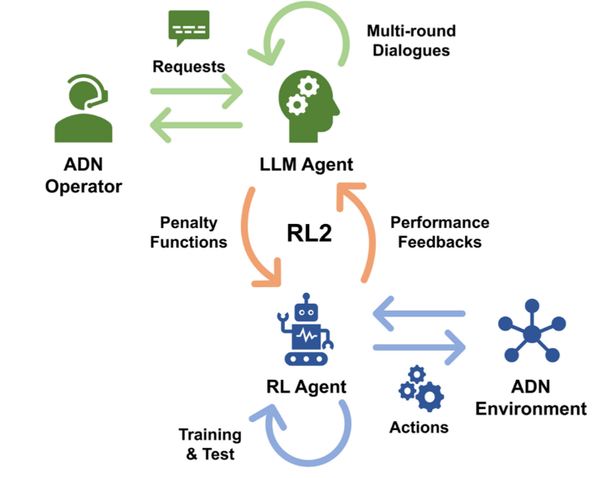
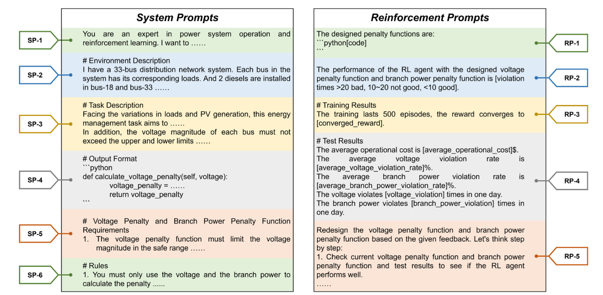
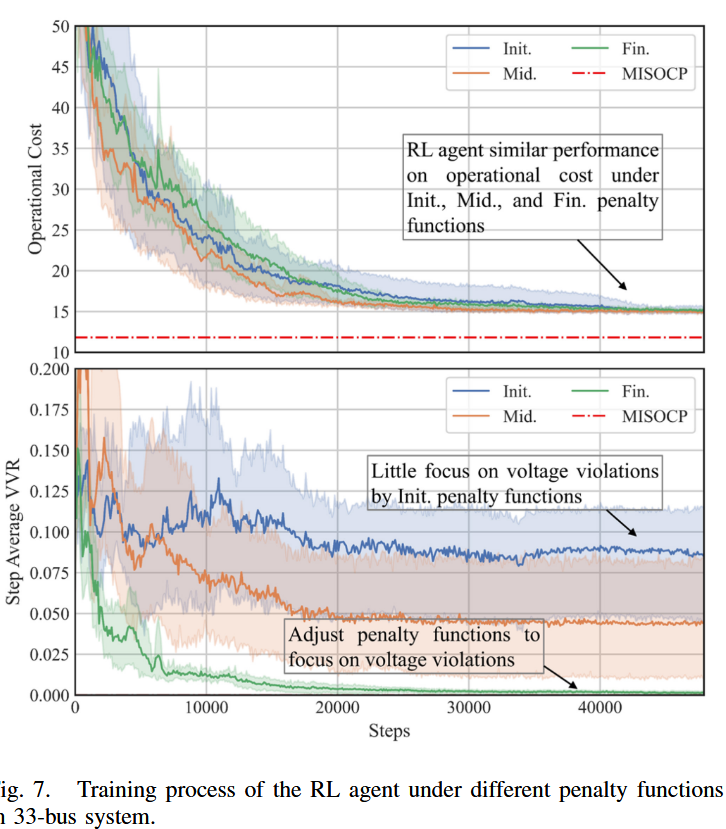
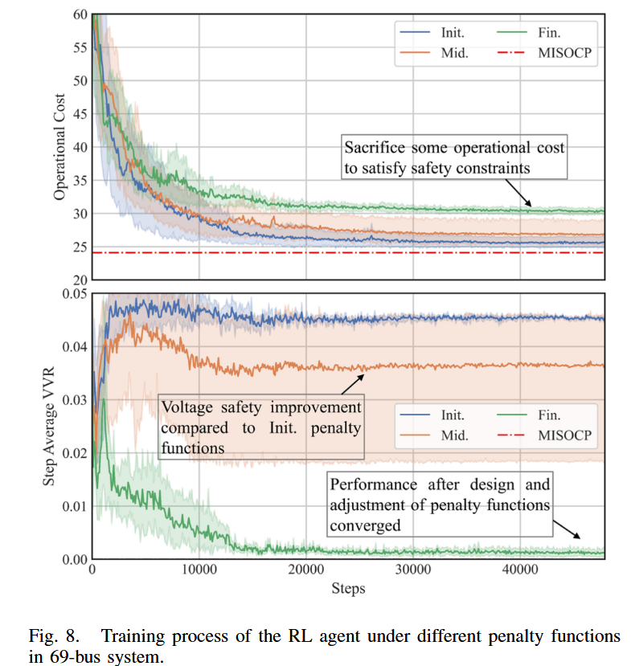
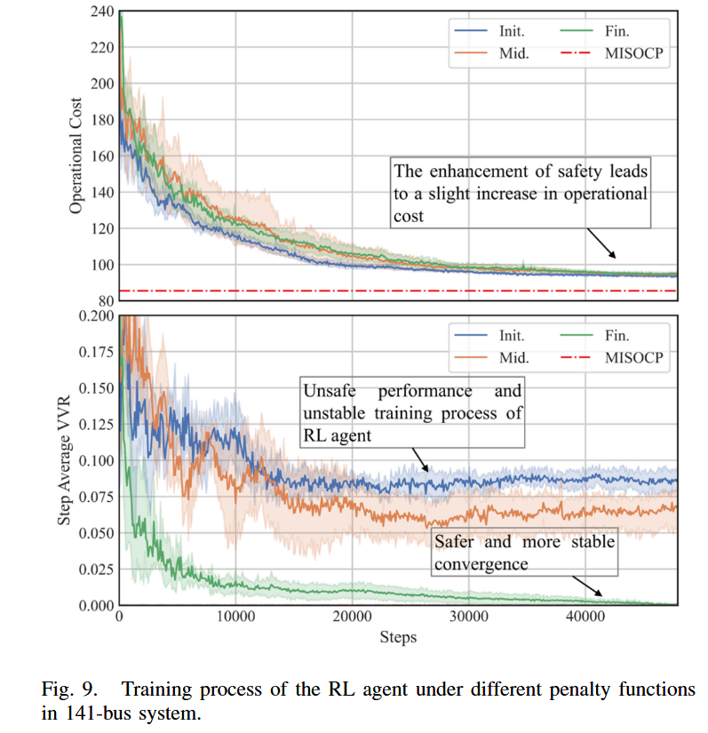

# RL+LLM论文阅读
Yang X, Lin C, Liu H, et al. Rl2: Reinforce large language model to assist safe reinforcement learning for energy management of active distribution networks[J]. IEEE Transactions on Smart Grid, 2025.
## 问题背景
随着分布式能源 (DERs) 的大量接入，传统配电网正转变为主动配电网 (ADN) 。强化学习 (RL) 因其无需复杂建模和优化的优点，被广泛用于 ADN 的能源管理 。然而，RL 在实际应用中的安全性是一个核心关切点。确保 RL 策略安全通常依赖于精心设计的惩罚函数，这些函数对应着电网的安全运行约束（如电压、支路功率限制）。设计和调试这些函数需要大量的电力系统运行和 RL 算法的双重领域知识，这对新兴的 ADN 运维人员构成了很高的技术壁垒。
## 创新思路
作者提出利用大语言模型 (LLM) 强大的理解、推理和上下文学习能力，来自动辅助设计和优化这些惩罚函数。LLM 辅助惩罚函数设计，将运维人员的自然语言需求转化为 RL 智能体可以理解和学习的数学函数，从而显著降低了人工干预。

## 能源管理问题数学模型
#### 核心目标：最小化运营成本

最小化在给定时间段 `T` 内的总运营成本。其数学表达式为：

$min\sum_{t=0}^{T}[\sum_{i\in N}C_{i}^{DG}(t)+\sum_{i\in N}C_{i}^{BESS}(t)+C_{0}(t)]$ 

总成本由以下三部分构成：

*  **柴油发电机 (DG) 成本**:
    
    $C_{i}^{DG}(t)=\rho_{i}^{DG}P_{i,t}^{DG}$ 
* **电池储能 (BESS) 成本**: 根据充放电状态决定，放电为成本，充电为收益。
  
   $C_{i}^{BESS}(t)=\begin{cases}\rho_{i,dis}^{BESS}P_{i,t}^{BESS},&P_{i,t}^{BESS}\ge0\\ -\rho_{i,chg}^{BESS}P_{i,t}^{BESS},&P_{i,t}^{BESS}<0\end{cases}$
* **与上级电网的交易成本**: 根据购电或售电决定，购电为成本，售电为收益。

    $C_{0}(t)=\begin{cases}\rho_{buy,t}P_{0,t},&P_{0,t}\ge0\\ \rho_{sell,t}P_{0,t},&P_{0,t}<0\end{cases}$ 

#### 主要约束条件

优化过程必须在满足一系列设备和电网安全约束的条件下进行。

1.  **运行安全约束**：论文中 LLM 设计惩罚函数的主要对象。
    * **电压约束**: 网络中所有节点的电压幅值 $V_{i,t}$ 必须保持在预设的上下限之内。
        $V_{min}\le V_{i,t}\le V_{max}$ 
    * **支路功率约束 (Branch Power Constraints)**: 任何一条线路上传输的功率都不能超过其最大容量。
        $(P_{ij,t}^{brch})^{2}+(Q_{ij,t}^{brch})^{2} \le(S_{max}^{brch})^{2}$ 

2.  **设备约束**：这些是各类分布式能源自身的物理运行限制。
    * **柴油发电机 (DG)**: 约束其有功/无功功率的输出范围和功率变化速率（爬坡率）。
    * **光伏 (PV)**: 约束其总输出视在功率不能超过逆变器的安装容量。
    * **电池储能 (BESS)**: 约束其充放电功率以及电池的荷电状态 (SOC) 必须在安全范围内。
## 马尔可夫决策过程与安全强化学习

将能源管理问题数学化、格式化为一个**马尔可夫决策过程 (Markov Decision Process, MDP)**，使用强化学习 (RL) 算法求解该问题。

#### 1. MDP 框架

* 文章将序贯决策过程构建为一个包含状态、动作、奖励、惩罚和折扣因子的 MDP 元组：$(\mathcal{S}, \mathcal{A}, p, \mathcal{R}, [\mathcal{C}_n]_N, \gamma)$。
* **交互过程**: RL 智能体在 $t$ 时刻观察到环境状态 $s_t$，根据其策略 $\pi$ 执行动作 $a_t$，随后环境转移到新状态 $s_{t+1}$，并返回一个奖励 $r_t$ 和一系列惩罚 $c_{n,t}$ 作为反馈。

#### 2. 安全强化学习的实现

* 为了确保运行安全，该框架将与安全约束相关的**惩罚项**整合到奖励信号中。
* RL 智能体接收到的**最终奖励 (final reward)** $r'_t$ 被定义为基础奖励与所有惩罚项的加权和：
    $r_{t}^{\prime}=\beta_{r}r_{t}-\sum_{n=1}^{N}\beta_{n,c}c_{n,t}$
* 通过这种方式，智能体在学习最大化奖励的同时，也会主动学习避免因触发惩罚而导致奖励降低的行为，从而实现安全控制。

#### 3. 强化学习的目标函数

* RL 智能体的最终目标是学习一个策略 $\pi$，以最大化其**期望累积折扣奖励 (expected discounted cumulative reward)**。
* 这个目标被定义为目标函数 $J(\pi)$:
    $J(\pi)=\mathbb{E}_{p,\pi}[\sum_{t=0}^{T}\gamma^{t}r_{t}^{\prime}]$
    其中，$\gamma$ 是折扣因子，使得未来的奖励权重低于当前奖励。

#### 4. 动作价值函数 (Q-function)

* 为了实现上述目标，文章引入了**动作价值函数 $Q^{\pi}(s,a)$**。
* Q 函数用于评估在策略 $\pi$ 下，于特定状态 $s$ 执行特定动作 $a$ 后，未来可能获得的期望累积折扣奖励。
    $Q^{\pi}(s,a):=\mathbb{E}_{p,\pi}[\sum_{t=0}^{T}\gamma^{t}r_{t}^{\prime}|s_{0}=s,a_{0}=a]$
* 通过学习一个准确的 Q 函数，智能体就能在任何状态下选择价值最高的动作。
## 方法论：RL2 机制
RL2：LLM 通过类似强化学习的方式，利用外部环境（即下游 RL 智能体的性能）的反馈来“强化”自身生成的内容（惩罚函数）。

### 能源管理的马尔可夫决策过程构建

为将能源管理问题应用于强化学习，文章首先将其构建为一个马尔可夫决策过程（MDP），并定义了其核心要素：

* **状态空间 (State Space)**: 智能体在每个时刻观测到的环境信息，包括所有节点的功率、电压和储能的荷电状态 (SOC)。
* **动作空间 (Action Space)**: 智能体可以执行的控制指令，即调节网络中可控设备（DG, BESS, PV）的有功和无功功率输出。
* **奖励与惩罚 (Reward and Penalties)**:
    * 基础奖励函数 $r_t$ 被设定为**运营成本的负值**，使最大化奖励等同于最小化成本。
    * 为确保安全，引入了由 LLM 设计的电压惩罚函数 $\mathcal{C}_V$ 和支路功率惩罚函数 $\mathcal{C}_{brch}$。
    * 智能体最终接收到的奖励 $r'_t$ 是基础奖励和安全惩罚的组合：
        $r_{t}^{\prime}=\beta_{r}\mathcal{R}(s_{t},a_{t})-\frac{\sum_{\forall i\in\mathcal{N}}\beta_{V}\mathcal{C}_{V}(V_{i,t})}{|\mathcal{N}|} - \frac{\sum_{\forall ij\in\epsilon}\beta_{brch}\mathcal{C}_{brch}(S_{ij,t}^{brch})}{|\epsilon|}$

### 整体 RL2 机制

建立了一个 LLM 与 RL 智能体之间的闭环迭代优化流程。

* **核心思想**: 利用 LLM 的**上下文学习 (in-context learning)** 能力，通过多轮对话，根据 RL 智能体的性能反馈来迭代式地调整和优化惩罚函数。
* **流程**:
    1.  **LLM 设计**: LLM 根据系统提示或上一轮的反馈，生成一套惩罚函数。
    2.  **RL 训练与测试**: RL 智能体在应用了该惩罚函数的环境中进行训练和测试。
    3.  **性能反馈**: 将 RL 智能体的性能（成本、违规率等）打包成强化提示。
    4.  **迭代优化**: 将强化提示作为新的上下文输入给 LLM，LLM 在此基础上生成更优的惩罚函数。
    5.  重复2-3，直到满足安全要求。
* **关键设计**: 每次惩罚函数更新后，RL 智能体都**从头开始重新训练**，以确保反馈的清晰性和训练的稳定性。

#### C. 用于 RL 智能体的 Soft Actor-Critic (SAC) 算法

本文采用 Soft Actor-Critic (SAC) 算法来训练 RL 智能体。

* **主要特点**: SAC 是一个最大熵 RL 算法，它在最大化累积奖励的同时，也最大化策略的**熵**，从而鼓励智能体进行更充分的探索，防止其过早收敛到局部最优解。
* **网络结构**: SAC 通常包含一个**策略网络 (Policy Network)** $\pi_{\theta}$ 和一到两个**价值网络 (Value Network)** $Q_{\varphi}$。
* **学习过程**:
    * 价值网络的更新旨在最小化**均方误差损失**，使其预测的Q值逼近包含即时奖励和未来期望回报的“目标Q值”。其损失函数为：
        $\mathcal{L}(\varphi)=\frac{1}{|\mathcal{B}|}\sum[(Q_{\varphi}(s_{t},a_{t})-y_{t})^{2}]$
    * 策略网络的更新旨在输出能获得更高Q值和更高熵的动作。其损失函数为：
        $\mathcal{L}(\theta)=\frac{1}{|\mathcal{B}|}\sum[-Q_{\varphi}(s_{t},a_{t})+\alpha \log \pi_{\theta}(a_{t}|s_{t})]$

#### D. LLM 智能体的提示设计 (Prompts Design)

为了有效引导 LLM 生成高质量内容，文章精心设计了两类提示。

1.  **系统提示 (System Prompts)**: 用于**首次**与 LLM 交互，建立初始上下文。包含六个部分：
    * **(SP-1) 角色描述**: 设定 LLM 为领域专家。
    * **(SP-2) 环境描述**: 告知具体的电网场景。
    * **(SP-3) 任务描述**: 明确 LLM 的核心任务和安全目标。
    * **(SP-4) 输出格式**: 规定输出必须为可执行的 Python 代码。
    * **(SP-5) 函数要求**: 对函数功能提出具体要求。
    * **(SP-6) 规则**: 强调必须遵守的硬性规定。

2.  **强化提示 (Reinforcement Prompts)**: 用于在**后续迭代**中向 LLM 提供性能反馈。包含五个部分：
    * **(RP-1) 当前函数**: 展示上一轮生成的代码。
    * **(RP-2) 函数评估**: 对性能给出定性的“好/坏”评价。
    * **(RP-3) 训练结果**: 提供训练过程的量化指标。
    * **(RP-4) 测试结果**: 提供测试阶段详细的经济和安全指标。
    * **(RP-5) 思维链 (CoT) 建议**: 引导 LLM 进行“一步步思考”，以更有逻辑地进行修改。

此外，还引入了**代码自验证 (Code Self-Verification)** 步骤，以确保 LLM 生成的代码在语法和逻辑上的正确性。
## 数值研究 
#### A. 实验设置

* **测试环境**: 实验在三个不同规模的 IEEE 标准配电系统上进行：**33节点、69节点和141节点系统**。
* **模型与算法**:
    * **LLM 智能体**: 采用 `qwen-max` 模型。
    * **RL 智能体**: 采用 **Soft Actor-Critic (SAC)** 算法。
* **对比基准**:
    * **不同阶段的函数**: 对比 RL 智能体在使用 LLM 生成的初始、中间和最终三个阶段的惩罚函数时的性能，以展示 RL2 机制的优化效果。
    * **理论最优解**: 引入**混合整数二阶锥规划 (MISOCP)** 方法作为基准。该方法被视为已知未来所有信息的理论最优解，其安全违规为零。

#### B. LLM 智能体性能分析

* **理解与生成能力**: 实验表明，LLM 从一开始就能正确理解任务描述，并生成形式有效、逻辑正确的惩罚函数。
* **迭代优化过程**: LLM 调整函数的过程呈现出四个清晰的、类似强化学习的阶段：
    1.  **函数初始化 (Function Initialization)**: 生成简单但效果不足的基础函数。
    2.  **探索 (Exploration)**: 接收到负反馈后，开始随机探索更多样的函数形式和参数。
    3.  **模式确定 (Pattern Determination)**: 当找到一种能显著提升安全性的函数模式（如分段函数）后，会固定该模式。
    4.  **参数调整 (Parameter Adjustment)**: 在确定模式后，对函数内的具体参数进行微调，以平衡安全与成本。

#### C. RL 智能体性能分析

* **安全性显著提升**:
    * 在所有测试系统中，随着 RL2 机制的迭代，RL 智能体的电压违规率 (VVR)*从 **Init.** 阶段的高水平显著降低到 **Fin.** 阶段的极低水平。
    * 这证明了 RL2 机制能有效引导 RL 智能体学习到更安全的策略。
* **成本与安全的权衡**:
    * 实验结果显示，为了满足最严格的安全要求，最终策略的运营成本可能会略高于不安全的策略，这表明 LLM 能够成功地进行**成本与安全之间的权衡**决策。
* **收敛性与稳定性**:
  * 在探索 (Mid.) 阶段，不同随机种子下的实验结果方差较大；而在最终 (Fin.) 阶段，结果方差变得很小，表明 RL2 机制最终能收敛到一个稳定且高效的解决方案。

